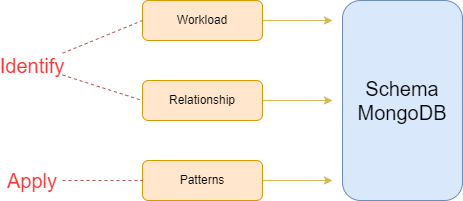

# MongoDB Design Patterns
MongoDB design patterns are strategies to structure your schema and data effectively based on your application's requirements.

Since MongoDB is a NoSQL database, it offers flexibility to design schemas tailored to your use case.

## Index
- [Recap](#recap)
   - [Golden rule](#golden-rule)
   - [Data modeling](#data-modeling)
      - [Workload](#workload)
      - [Relationship](#relationship)
- [Patterns](#patterns)
- [Anti-Patterns](#anti-patterns)
- [Real use case](#real-use-case)

## Recap
Before we get started, it's important to remember some concepts:

### Golden rule
```
Data that are accessed together should be stored together.
```

### Data modeling

[Data modeling](https://www.mongodb.com/docs/manual/data-modeling/) refers to the organization of data within a database and the links between related entities. Data in MongoDB has a flexible schema model, which means:
- Documents within a single collection are not required to have the same set of fields.
- A field's data type can differ between documents within a collection.

To ensure that your data model has a logical structure and achieves optimal performance, plan your schema prior to using your database at a production scale. To determine your data model, use the following schema design process:

- [Identify your application's workload](https://www.mongodb.com/docs/manual/data-modeling/schema-design-process/identify-workload/#std-label-data-modeling-identify-workload).
- [Map relationships between objects in your collections](https://www.mongodb.com/docs/manual/data-modeling/schema-design-process/map-relationships/#std-label-data-modeling-map-relationships).
- [Apply design patterns](https://www.mongodb.com/docs/manual/data-modeling/schema-design-process/apply-patterns/#std-label-data-modeling-apply-patterns).

This image shows how the steps below compose the schema on MongoDB:



[Let's identify the workload and define the relationship?](./docs/DATA_MODELING.md)

## Patterns
[Let's learn about it?](./docs/PATTERNS.md)

## Anti-Patterns
[Let's go](./docs/ANTI_PATTERNS.md)

## Real use case
TO DO: WHAT MORE???

Here we can see a real use case that uses these patterns: Bucket and Computed.
