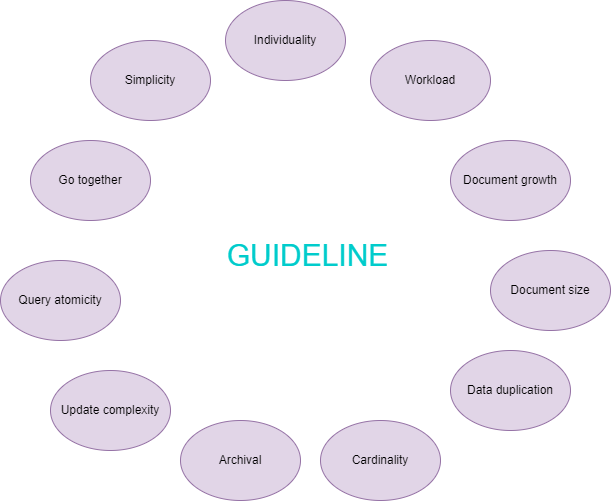

[Home](../README.md) > [Data Modeling](#)

# Data Modeling

#### Workload
Identify and describe the workload in the first step to model your database. You should:
- Identify and quantify the database entities and attributes:
    - A **entity** is a thing that exist in our database and it's unique and independent of each other.
    - A **attribute** is a property that describe an entity.
- Then, you should write the number of documents you expect for each entity (at least for the first year). Example:

| Entity       | Quantity  |
|--------------|-----------|
| Users        | 25,000    |
| Authors      | 50,000    |
| Books        | 200,000   | 
| Publishers   | 500       |
| Reviews      | 2,500,000 |

- Now, we should identify and quantity how the application will be **reading** and **writing** the entities.


| Action       | Query Type  | Information | Frequency | Priority  |
|--------------|-------------|-------------|-----------|-----------|
| The action that a user takes to trigger the query. | Read or write | The document fields that are either written or returned by the query. | How frequently your application runs the query. Queries that are run frequently benefit from indexes and should be optimized to avoid lookup operations. | How critical the query is to your application.

Example:
| Action                  | Query Type       | Information                   | Frequency          | Priority  |
|-------------------------|------------------|-------------------------------|--------------------|-----------|
| Fetch book details      | Read             | Book details + rating         | 1,000 / sec        | High      |
| Fetch reviews from book | Read             | Reviews + Reviewer rating     | 200 / sec          | High      |
| Fetch reviews from book | Read             | Reviews + Reviewer rating     | 200 / sec          | High      |
| Fetch user details      | Read             | User profile and preferences  | 5 per minute       | Medium    |
| Add/Update Book         | Write            | Book details                  | 20 per hour        | Medium    |
| Add/Update User         | Write            | Name, Email, Password         | 100 / day          | Low       |
| Submit Review           | Write            | Rating, Comments, Book ID     | 50 / sec           | High      |

It will help you:
- Identify which data is accessed together (and stored together).
- Determine which data we need for the application.
- Identify if our application performns more reads or writes and which are the hottest entities.
- In summary, it helps you to define relationships and models the collections.

#### Relationship

In MongoDB, you can use [references](https://www.mongodb.com/docs/manual/data-modeling/concepts/embedding-vs-references/#std-label-data-modeling-referencing) or [embedded documents](https://www.mongodb.com/docs/manual/data-modeling/concepts/embedding-vs-references/#std-label-data-modeling-embedding) to express relationship.

Using references:


Using embed:


Types of relationship:
- **Modeling one-to-one (1-1)**

| Relational database                                                                   | MongoDB                            |
|---------------------------------------------------------------------------------------|------------------------------------|
| Two tables: Each record in Table A is related to one record in Table B, and vice-versa | Use [**Embed**](https://www.mongodb.com/docs/manual/tutorial/model-embedded-one-to-one-relationships-between-documents/#std-label-data-modeling-example-one-to-one) as the first option, but you can also use **reference** in some cases |

Example of embed: A person can have a single passport.
```json
{
  "_id": "emp001",
  "name": "Alice Johnson",
  "position": "Software Engineer",
  "passport": {
    "passport_number": "AB123456",
    "issued_country": "USA",
    "expiry_date": "2030-05-20"
  }
}
```

Example of reference: An user must have a single desk.

```json
{
  "_id": "profile456",
  "user_id": "user123",
  "bio": "Software developer with 10 years of experience.",
  "website": "https://johndoe.dev",
  "location": "New York, USA"
}
```

```json
{
  "_id": "desk123",
  "desk_number": "A-45",
  "location": "Building 1, Floor 3",
  "features": ["Adjustable Height", "Monitor Stand"]
}
```

> The reference option here could be an alternative when this second entity is more used in other workloads and the data between the two entities are not offen access together.

- **Modeling one-to-many (1-N)**

| Relational database                                                                   | MongoDB                            |
|---------------------------------------------------------------------------------------|------------------------------------|
| Two tables: Each record in Table A can be related to multiple records in Table B, but each record in Table B is related to only one record in Table A. | The most common option is to [Embed](https://www.mongodb.com/docs/manual/tutorial/model-embedded-one-to-many-relationships-between-documents/#std-label-data-modeling-example-one-to-many), but you may also [reference](https://www.mongodb.com/docs/manual/tutorial/model-referenced-one-to-many-relationships-between-documents/#std-label-data-modeling-publisher-and-books) |

Example of embed: A person could have multiples addresses.
```json
{
   "_id": "joe",
   "name": "Joe Bookreader",
   "addresses": [
      {
         "street": "123 Fake Street",
         "city": "Faketon",
         "state": "MA",
         "zip": "12345"
      },
      {
         "street": "1 Some Other Street",
         "city": "Boston",
         "state": "MA",
         "zip": "12345"
      }
   ]
}
```

> Embedding is a good choice when the the information in the N side cannot exist without the parent. It's also a good choice when the N side does not have to many elements (example, addresses and phones).

Example of reference: A publisher can publish multiple books.
```json
{
   "name": "O'Reilly Media",
   "founded": 1980,
   "location": "CA",
   "books": [123456789, 234567890]
}
```

```json
{
    "_id": 123456789,
    "title": "MongoDB: The Definitive Guide",
    "author": [ "Kristina Chodorow", "Mike Dirolf" ],
    "published_date": "2010-09-24",
    "pages": 216,
    "language": "English"
}
{
   "_id": 234567890,
   "title": "50 Tips and Tricks for MongoDB Developer",
   "author": "Kristina Chodorow",
   "published_date": "2011-05-06",
   "pages": 68,
   "language": "English"
}
```

> It's a good choice when the N side has hundred or millions of elements. Example, reviews from a book.

- **Modeling many-to-many (N-N)**

| Relational database                                                                   | MongoDB                            |
|---------------------------------------------------------------------------------------|------------------------------------|
| Three tables: Each record in Table A can be related to multiple records in Table B, and each record in Table B can also be related to multiple records in Table A. Create an association table (junction table) to represent the relationship. | In most case use [**Embed**](https://www.mongodb.com/docs/manual/tutorial/model-embedded-many-to-many-relationships-between-documents/). You can use **reference** but it's not recommended as it is hard to manage |

Example of embed: A book can have multiple authors and an author can write multiple books.
```json
{
   "_id": "book001",
   "title": "Cell Biology",
   "authors": [
     {
        "author_id": "author124",
        "name": "Ellie Smith"
     },
     {
        "author_id": "author381",
        "name": "John Palmer"
     }
   ]
}
```

```json
{
   "_id": "book002",
   "title": "Organic Chemistry",
   "authors": [
     {
        "author_id": "author290",
        "name": "Jane James"
     },
     {
        "author_id": "author381",
        "name": "John Palmer"
     }
   ]
}
```

> It generates data duplication.

Example of reference: A student can enroll in multiple courses and a course can have multiple students.
```json
{
  "_id": "student001",
  "name": "Alice Johnson",
  "email": "alice@example.com",
  "courses": ["course001", "course002"]
}
```

```json
{
  "_id": "course001",
  "title": "Database Design",
  "instructor": "Dr. Smith",
  "students": ["student001", "student002", "student003"]
}
```

> Using reference in N:N relationship is to hard to maintain.

Please, use the **guideline** below to decide if it's better embed or reference:



> TIP: The child document make sense without the parent? If not, you probably must embed.

[Home](../README.md) > [Data Modeling](#)
